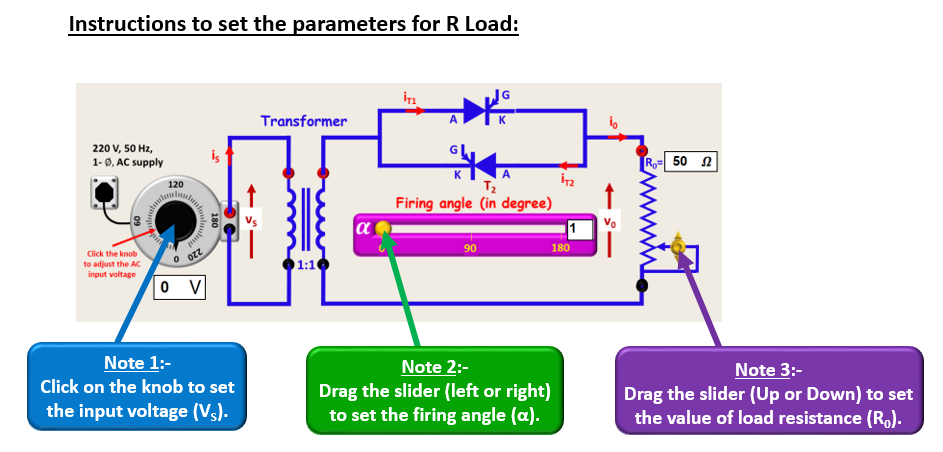
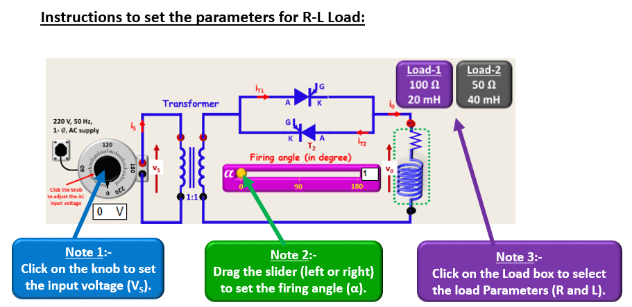

### Procedure

  

a) Circuit formulation:
 
1. Connect the circuit to form a AC Voltage Controller by selecting one of the two options

2. 
    a). If all connections are correct then click on “NEXT” button and proceed for experimentation. 
    b). If connections are wrong. Press the “RESET” button and reconnect the terminals to create correct circuit. 

  

b) Operating the circuit: 
 
1) Select the type of load (R or R-L) and vary the firing angle (α : 0° to 180°). 
2) Press “PLOT” button to simulate the circuit and observe various waveforms. 
3) Change “α” to observe the waveforms at different operating conditions. 

c) Performance analysis of the circuit: 
  
1) Set the values of source voltage (VS), type of load (R or R-L) and firing angle (α : 0° to 180°). 
2) Select the “ICONS” in sequence to analyse and understand the circuit operation and performance. 
3) Follow the instructions given in respective experiment slide and press the “RECORD” button to fill the observation table. 

  

