### Theory

The circuit configuration of AC voltage controller is given in Fig. 1.

  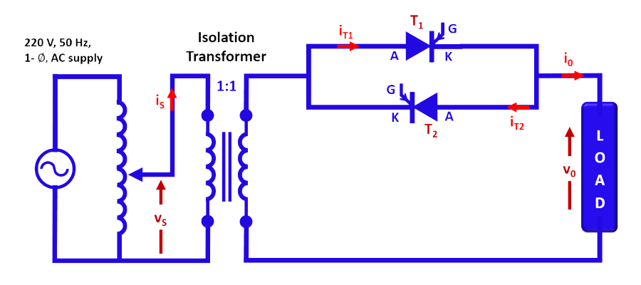
  
Fig. 1. Circuit configuration of AC voltage controller.

 
The principle of operation of AC voltage controller is explained with resistive (R) and resistive-inductive (R-L) load as shown in Fig. 2.
  

  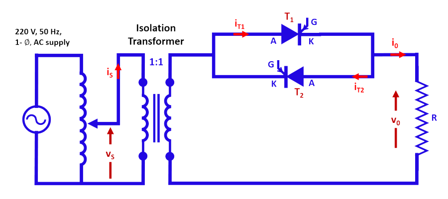
  
Fig. 2a. Circuit configuration of AC voltage controller with R-load.

  

  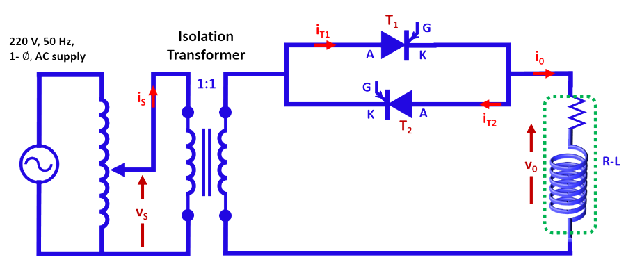
  
Fig. 2b. Circuit configuration of AC voltage controller with R-L load.

  

**1. AC Voltage controller with R-Load**

 
The circuit configuration of AC voltage controller with R-load is shown in Fig. 2a and the corresponding waveforms are shown in Fig. 3.

  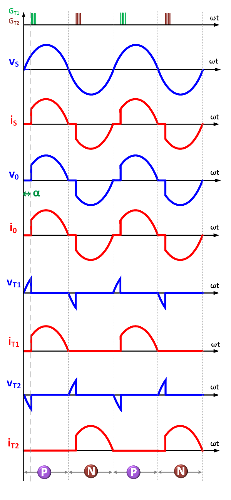
  
Fig. 3. Typical waveforms with R-load (α<90&#176;).

 
Let the source voltage be
 

 

  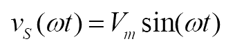

    ..(1)

  

 
Then the load voltage  is
 

 

  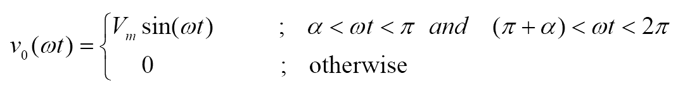
      

    ..(2)
      
     
  

 
Hence the ‘rms’ value of load voltage is:
 

 

  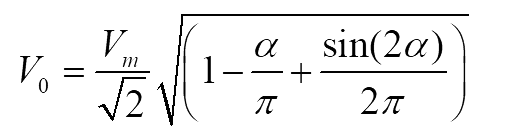
      

    ..(3)

  

 
and ‘rms’ load current is given by
 

 
 

  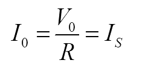
      

    ..(4)
   
      

 

 
The power factor is
 

 

  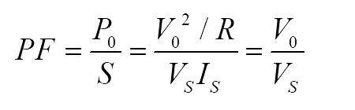
      

    ..(5)
   
      

 

  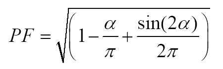
      

    ..(6)
   
      

 

 
The ‘rms’ current through SCR is given by
 

 

  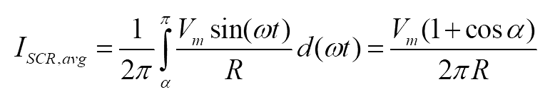
      

    ..(7)
   
      

 

  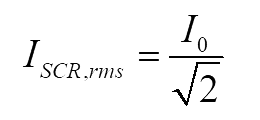
      

    ..(8)
   
      

 

 
The fundamental component of load voltage is 
 

  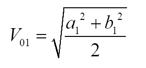
      

    ..(9)
   
      

 
where
 

 

  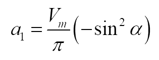
      

    ..(10)
   
      

 

 
and
 

 

  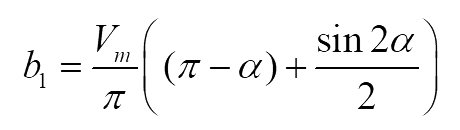
      

    ..(11)
   
      

 

 
Hence, total harmonic distortion (THD) is given by
 

 

  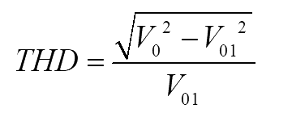
      

    ..(12)
   
      

 
 

**2. AC Voltage controller with R-L Load**

 
The circuit configuration of AC voltage controller with R-L load is shown in Fig. 2b and the corresponding waveforms are given in Fig. 4.

  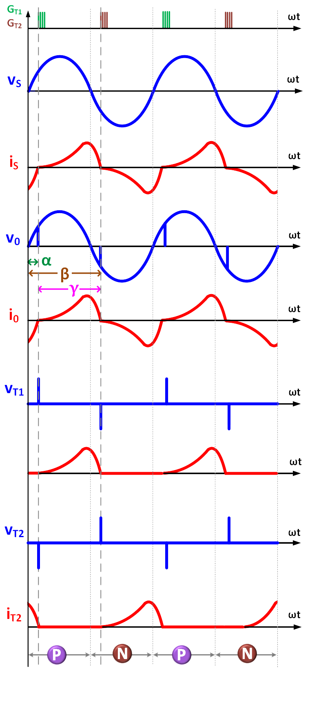
  
Fig. 4. Typical waveforms with R-L load (α<90&#176;).

 
The load voltage is defined by 
 

  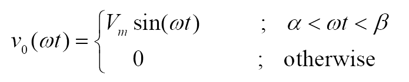
      

    ..(13)
   
      

 
Applying Kirchhoff’s voltage law
 

  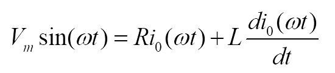
      

    ..(14)
   
      

 
 
Solving the above equation 
 

  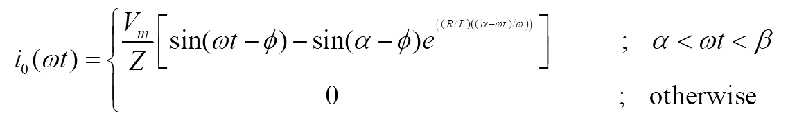
      

    ..(15)
   
      

 
 
where
 

  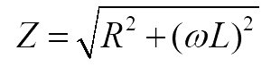
      

    ..(16)
   
      

 
 
And
 

  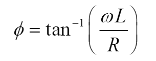
      

    ..(17)
   
      

 
 
Let
 

  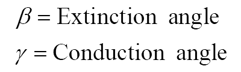
      

 
 
For the given firing angle and R-L load parameters, the extinction angle is given by
 

  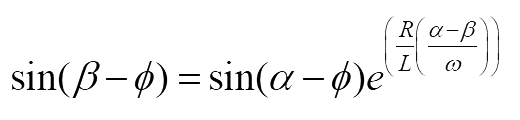
      

    ..(18)
   
      

 
 
And conduction angle
 

  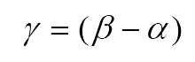
      

    ..(19)
   
      

 
 
The condition to get controlled output is
 

  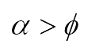
      

    ..(20)
   
      

 
 
otherwise the load voltage is same as the input voltage. 
The fundamental component of load voltage is 
 

  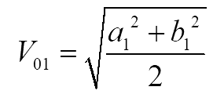
      

    ..(21)
   
      

 
 
where
 

  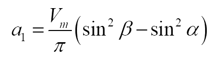
      

    ..(22)
   
      

 
 
and
 

  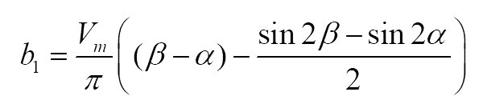
      

    ..(23)
   
      

 
 
Hence, total harmonic distortion (THD) is given by
 

  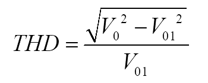
      

    ..(24)
   
      

 
